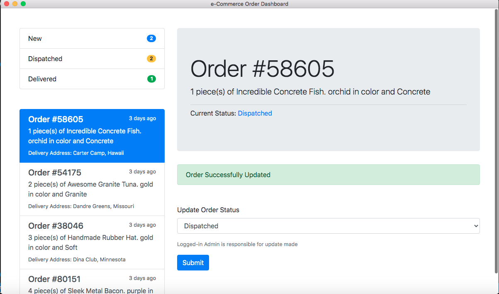

# Order dashboard desktop manager with Electronjs, Node.js and Twilio

## Project Setup

### Backend

- Navigate to the root of the `backend` folder
- Install dependencies using `npm install`
- Create a `.env` file at the root and fill in the details shown below:

```
PORT=5000

TWILIO_SID=XXX-XX-XXXXX
TWILIO_TOKEN=XXX-XX-XXXXX
TWILIO_NUMBER=XXX-XX-XXXXX

```

- Run the application using `npm start`

### Desktop Client

- Navigate to the root of the `order-dashboard` folder
- Install dependencies using `npm install`
- Run the application with `npm start`

## Screenshots

Dashboard page


